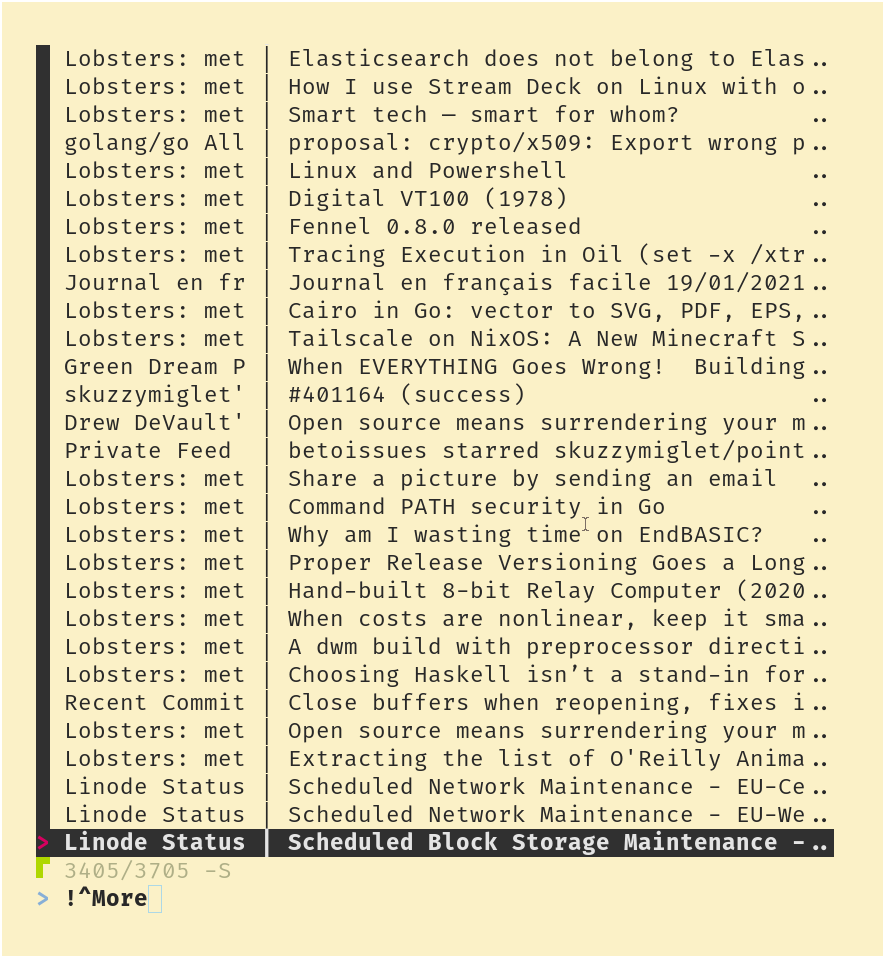

# feef

feef isn't a feed reader, it's a feed tool. It can be used in scripts, or as a basis for a feed reader

feef uses Go templates for output formatting and [expr](https://github.com/antonmedv/expr) for filtering. This makes feef quite easy to use but very flexible. It errs on the "do it all in 1 command" side, for better or for worse

feef is not yet stable. Your mileage may vary as RSS can be very different across the web. If you find a bug or think a feature would go well with `feef`, create a GitHub issue or a Sourcehut ticket

# examples

```sh
feef -f '{{.Link}}' -u '~lobsters' -i 'Title contains "Genode"' # Show me the links of items with titles containing Genode on Lobsters
feef -n new -c "notify-send '{{.Feed.Title}}' '{{.Title}}'" -f '{{.Link}}' # Notify me of new items with notify-send
feef -s -m 10 -c "wget -nc -O '{{slug .Title}}.mp3' '{{(index .Enclosures 0).URL}}' || echo {{.Title}} already downloaded" -u 'https://feeds.soundcloud.com/users/soundcloud:users:237055046/sounds.rss' # Download the 10 newest items of the Lingthusiasm podcast
```

# rationale

+ I needed a tool for downloading podcast episodes, and I'm not happy `grep`ping raw XML or manually copy-pasting links
+ I want to be notified of new items automatically
+ I got annoyed with newsboat's UI. Read/unread was just an annoyance for me (I'm not reading every post on Reddit). The simple [feef-read](https://git.sr.ht/~skuzzymiglet/feef/tree/master/item/feef-read) script in this repo allows you to see everything at a glance, without visual clutter.

# installation

`go get -u -v git.sr.ht/~skuzzymiglet/feef`

Put file with the URLs you want to read, one per line, in `.config/feef/urls` or wherever you put your configs. Alternatively, specify a URLs file with the `-U` flag.

Note you don't need a URLs file if you provide an exact URL to query

# usage

Running `feef` with no options will print the GUID of every item of every feed in your URLs file.

## URL matching

Use `-u` to specify an URL. You can use exact URL, or prefix with these symbols:

+ ` ~`: fuzzy match
+ `/`: regex (Go `regexp`) match
+ `?`: glob match

`~` and `/` alone can be used to match every URL

Default: `~`

## templates

feef uses [Go templates](https://godocs.io/text/template) to format the output

Templates specified with `-f` are printed to the standard output, with newlines between them. Templates specified with `-c` are evaluated then passed as commands to the shell

To find out what fields you can use, see [gofeed.Item](https://godoc.org/github.com/mmcdole/gofeed#Item). Additionaly, you can use `.Feed` to access the parent [gofeed.Feed](https://godoc.org/github.com/mmcdole/gofeed#Feed). You can see all the values in an item with the template `{{.}}`

Some useful template functions are provided:

+ `datef`: format dates
+ `slug`: transform a string into a path/URL friendly format
+ `trunc`: truncate a string to a length
+ `truncPad`: truncate or pad a string to a length
+ `sanitizeHTML`: sanitize HTML (strictest policy)

Refer to [defaultFuncMap](https://git.sr.ht/~skuzzymiglet/feef/tree/master/item/templates.go#L13) for definitions

Default: `{{.GUID}}` (the GUID of the item)

## filtering

Filtering is done with [expr](https://github.com/antonmedv/expr) expressions. The same data is provided to expressions as to templates. Expressions must return a boolean.

Default: `true`

## notifications

feef can notify you of new items. Specify a notification mode with `-n`. There are 3 modes:

+ `new`: print new items
+ `all`: print all items, then new items as they come
+ `none`: print all items and exit

You can use `-r` to control the interval for polling feeds for changes. By default this is 2 minutes

Default: `none`

## other options

+ `-s` sorts items chronologically. All items need to be accumulated, which makes this seem slow
+ `-e` exit when commands (`-c`) fail
+ `-E` exit when there's an error fetching a feed (TODO)
+ `-m n` stops feef after _n_ numbers have passed through the filter
+ `-p n` allows up to _n_ threads to be fetching at the same time
+ `-l` controls the log level. This can be one of `panic`, `fatal`, `error`, `warn`, `info`, `debug` or `trace`, case-insensitive. See [the loglevel-parsing code](https://github.com/sirupsen/logrus/blob/master/logrus.go#L24)
+ `--cpu-profile` and `--memory-profile` run CPU and memory profiles respectively. The location of the profiles is printed to stderr at the end

# UI



The [feef-read](https://git.sr.ht/~skuzzymiglet/feef/tree/master/item/feef-read) script is a simple but flexible RSS reader, with notifications of new items. The items are formatted and piped into [fzf](https://git.sr.ht/~skuzzymiglet/feef/tree/master/item/feef-read). You can fuzzy-search the items.

feef-read binds these keys:

+ `enter`: open the selected item's `Link` with xdg-open or the `$OPENER` environment variable
+ `tab`: toggles the sort order between best match and chronological
+ `ctrl-d`: downloads the item's `Link` using `wget` or the `$DOWNLOADER` environment variable

feef-read also notifies you of new items using `notify-send`

# BUGS/TODO

Bugs and TODOs are noted in comments near the relevant code. A quick `rg TODO` should work. Major ones are listed here:

+ Logging and loglevel separation need work
+ A way to work feed-wise is needed. Currently you can't retrieve info about a feed
+ Libify the logic
+ Provide more info to expr filters
